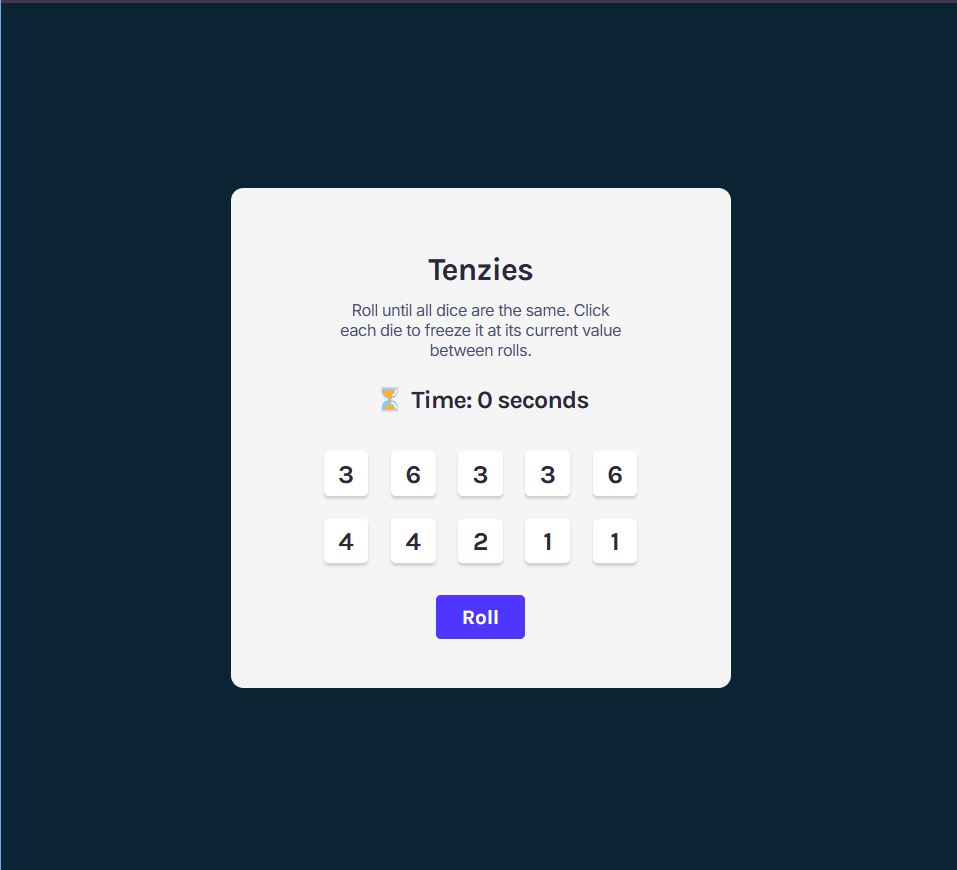
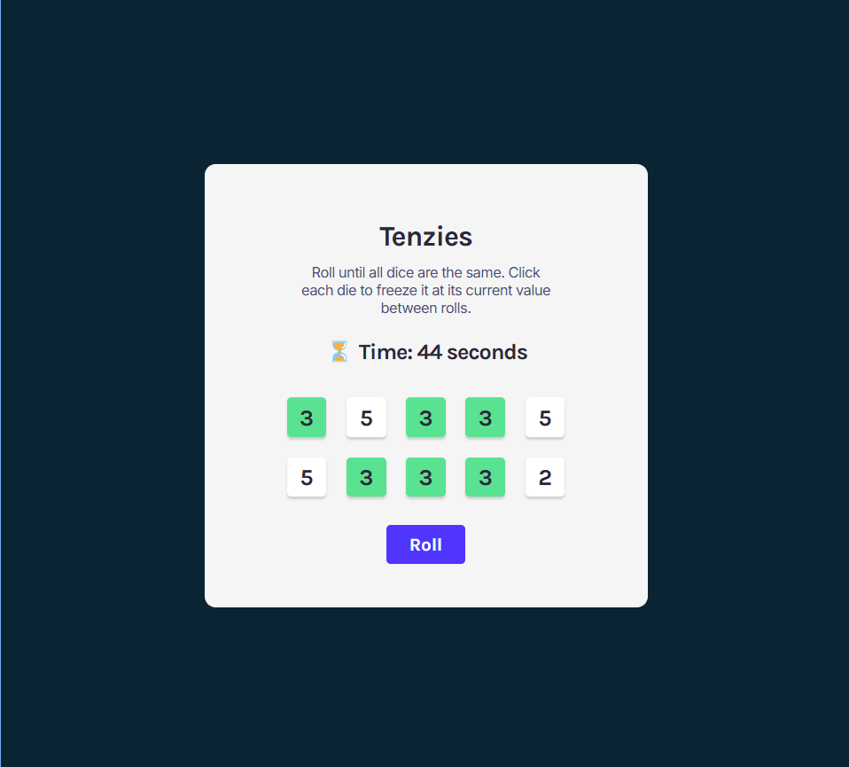
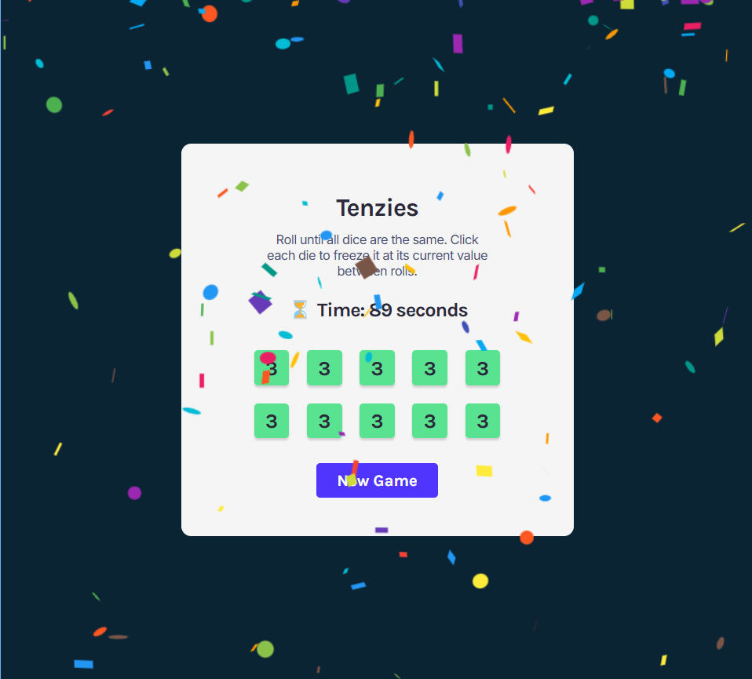

# 🎲 Tenzies Game - React App

A fun and interactive dice-rolling game built with **React.js** and **Vite**.

## 🚀 Live Demo  
🔗 [Play Tenzies Game](https://prachi1025.github.io/React-Tenzies-App/)  

---

## 📌 Features  
✅ Roll dice until all numbers match  
✅ Click to "hold" dice and prevent them from rolling  
✅ Win when all dice show the same number  
✅ Modern UI with smooth state management  

---

## 📸 Screenshots  

### 🎮 Gameplay

---

## 🛠 Tech Stack  
- ⚛️ **React.js** – UI Components  
- 🎲 **nanoid** – Unique IDs for dice  
- 🎨 **CSS** – Styled layout  
- ⚡ **Vite** – Fast development  
